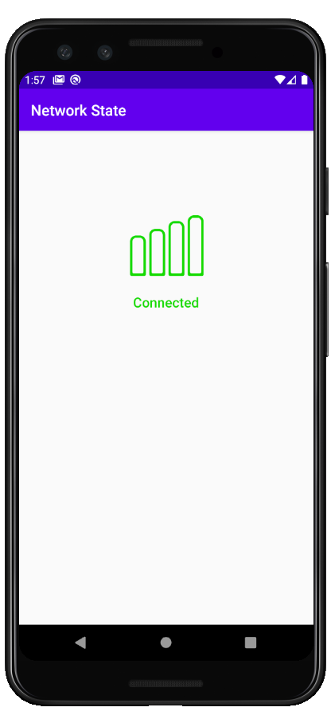

# Network State

### **Overview - About this project**
Simple project to handle network connection status with **LiveData**

### 📷 How is this App
</img>
</img>

### 💻Technology
- [Kotlin](https://kotlinlang.org/)

### Donation
If this project help you reduce time to develop, you can buy me a cup of coffee :) 

